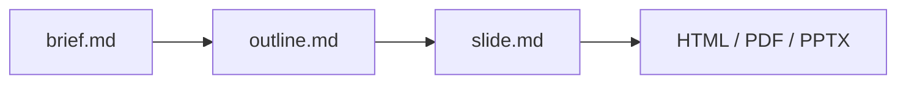

**GitHub**: [takumi-nishimura/MarpAgent](https://github.com/takumi-nishimura/MarpAgent)

スライドを Markdown で書ける [Marp](https://marp.app/) は手軽だが, 実際に作っていると毎回同じところでつまずく. 文字がスライド枠からあふれる, 箇条書きが詰まりすぎる, 見出しが長すぎてフォントが勝手に縮む. こうした崩れは, たいてい本番直前のプレビューで初めて気づく.

**MarpAgent** は, この「書いてから崩れに気づくまでの手戻り」をなくすために作った CLI ツールである. コマンドは `marpx`. Marp での執筆を構造化し, レイアウトの崩れを書いている段階で自動的に検出する. そしてもう一つの狙いとして, **Claude Code のようなコーディングエージェントにスライドそのものを書かせる**ことを前提に設計している.

実際のスライド例は [decks/example/slide.pdf](https://github.com/takumi-nishimura/MarpAgent/blob/main/decks/example/slide.pdf) に置いている. この記事の画像も, その example デッキから引用している.

## 全体の流れ

MarpAgent は, 思いつきでスライドを書き始めるのではなく, 次の順序で組み立てる.



- **brief.md**: 対象聴衆, 発表時間, 一番伝えたいこと, 必要なセクションを最初に定義する
- **outline.md**: brief をもとにレイアウトのヒント付きでスライド構成を自動生成する
- **slide.md**: `lab` テーマを使った Marp Markdown で本文を書く
- **Validator**: オーバーフロー, 詰まりすぎた箇条書き, 長すぎる見出し, フォント縮小を検知する

最初に brief で骨子を固めてから書くので, 「とりあえず書いたが構成が破綻していた」という事態を避けやすい.

## エージェントにスライドを書かせる

MarpAgent の一番の狙いは, このワークフローをコーディングエージェントに任せられるようにすることである. リポジトリの `.agents/skills/` に, エージェント向けの執筆ガイド (スキル) を同梱している.

- **参照スキル** (自動で読み込まれる): `marp-slide-types` (スライド型のテンプレート), `marp-components` (コールアウト, 図, Mermaid, 脚注), `marp-validator` (バリデータのルールと上限値)
- **タスクスキル** (スラッシュコマンド): `/slide-new` (brief から slide まで一気通貫で新規作成), `/slide-add` (既存デッキへのスライド追加), `/slide-review` (検証と自動修正)

人は brief で「誰に何を伝えたいか」だけを与え, あとはエージェントが outline 生成, 執筆, 検証と修正まで回す, という分担ができる. ここで効いてくるのが後述のバリデータで, **エージェントが生成したスライドを機械的に検査し, 崩れていれば直す**ところまでをループにできる. Markdown の記法をすべて覚えていなくても始められる.

## 見た目: labテーマとTailwind

スライドの見た目は `lab` テーマで制御する. このテーマは **Tailwind CSS v4** で構築されており, カラースキームやレイアウト, コールアウトをクラス指定で切り替えられる.


*Labテーマ. 5種のカラースキーム, レイアウト, 組み込みコンポーネントを備える.*

- **カラースキーム (5種)**: Dracula, One Dark Pro, Nord, Neogaia, GitHub Light
- **レイアウト**: title / content / two-column
- **コールアウト**: `.note`, `.tip`, `.important`, `.warning`, `.caution`
- **タイポグラフィ**: `.text-xs` から `.text-xl5` までのスケール
- **Mermaid ダイアグラム**と **MathJax** 数式に対応

Mermaid は日本語 (CJK) のラベルにも対応している. 標準の Mermaid は文字幅をラテン文字の幅で見積もるため, 日本語のラベルはノードの枠からはみ出して崩れやすい. MarpAgent は CJK の文字幅を考慮して描画するので, 日本語ラベルも枠に正しく収まる.


*`.tip` コールアウトと, 日本語ラベルの Mermaid の例. 日本語もノードの枠に収まる.*

テーマ自体は `npx marpx --theme lab` でビルドでき, `-w` を付ければ編集を監視しながら再ビルドする.

## プレゼンモード: レーザーポインタ

発表中に注目してほしい箇所を指せるよう, レーザーポインタを内蔵している. オレンジのドットにグローがかかり, マウスに追従する. しばらく動かさないと自動で消える.


*プレゼンモードのレーザーポインタ (オレンジのドット + グロー).*

## オーバービューモード

全スライドをサムネイルで一覧できるオーバービューモードがある. 構成を俯瞰したいときや, 目的のスライドへ飛びたいときに使う.


*オーバービューで全スライドを一覧する.*

```bash
npx marpx decks/my-talk/slide.md --overview
```

## 自動バリデーション

MarpAgent の中心はバリデータである. ヘッドレスブラウザで実際に描画し, スライドの内容がはみ出していないか, 箇条書きが密すぎないか, 見出しが長すぎないか, フォントが縮んでいないかを機械的にチェックする.

```bash
npx marpx decks/my-talk/slide.md -v
```

検出だけでなく, 安全な範囲の崩れは自動修正できる.

```bash
npx marpx decks/my-talk/slide.md --lint --autofix
```

検証結果は SARIF 形式でも出力できるので, GitHub の code scanning などのパイプラインに載せられる. `npm run quality:gate` で単体テストとフィクスチャ検証をまとめて回す仕組みも用意しており, スライドの品質チェックを CI の一部にできる. 前述のエージェント運用と組み合わせると, 生成から検証までを一つの流れにできる.

```bash
npx marpx decks/my-talk/slide.md -v --format sarif
```

## 使い始める

```bash
# 1. プロジェクトを作る
npx marpx -n decks/my-talk

# 2. decks/my-talk/brief.md を埋める (8セクション)

# 3. アウトラインを生成
npx marpx decks/my-talk/brief.md --outline

# 4. decks/my-talk/slide.md を書く

# 5. 編集しながらライブプレビュー
npx marpx decks/my-talk/slide.md

# 6. 検証
npx marpx decks/my-talk/slide.md -v
```

Node.js 25.x を前提とし, `npm install` で `marpx` ごと入る.

## まとめ

MarpAgent は, Marp の手軽さを保ちつつ, スライド作成を「構成を決める, 書く, 崩れを自動で潰す」という流れに落とし込むためのツールである. さらにその流れをエージェントに任せられるようにし, テーマや Tailwind で見た目を整え, レーザーポインタやオーバービューで発表まで支えることを狙っている.
